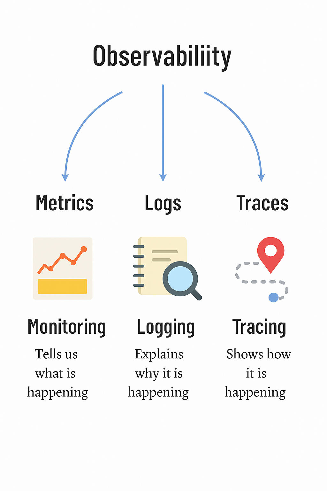
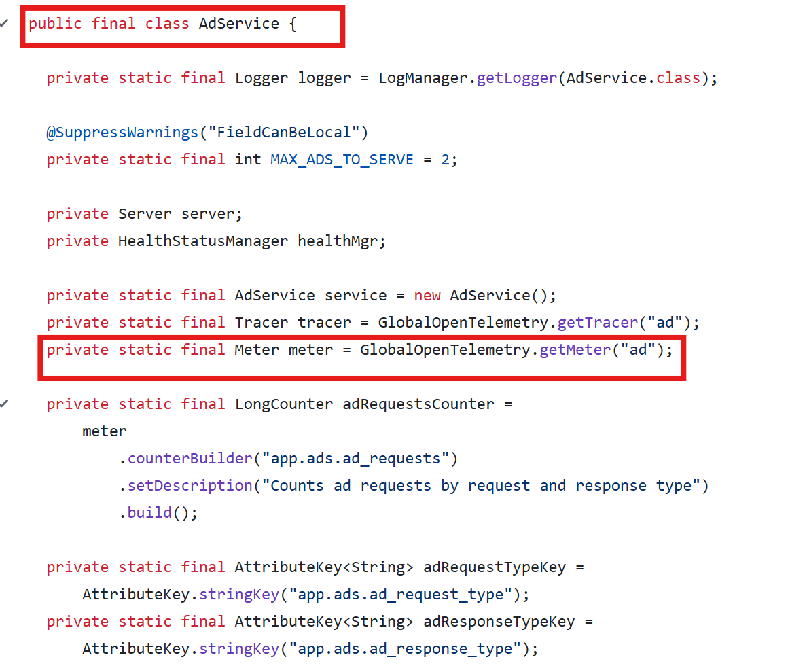
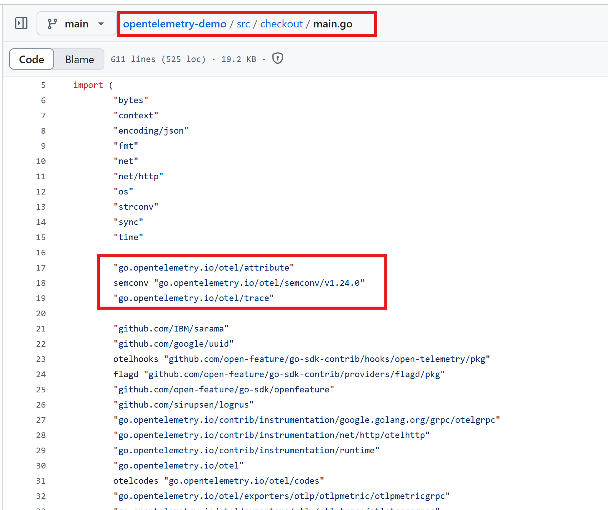

## 📡 Introduction to Observability

**Observability** is the ability to understand the internal state of a system by analyzing the data it produces — primarily **metrics**, **logs**, and **traces**. It helps DevOps teams detect, debug, and resolve issues in complex, distributed systems.

---

### 📊 Monitoring (Metrics)

Monitoring involves tracking system metrics such as CPU usage, memory consumption, disk I/O, and network traffic. These metrics provide insights into the performance and health of a system in real time.

- ✅ Helps detect performance degradation and resource exhaustion
- ✅ Can trigger alerts based on thresholds or conditions

> **🔎 Monitoring tells us *what* is happening.**

---

### 🧾 Logging (Logs)

Logging is the practice of collecting, storing, and analyzing log data generated by applications and infrastructure. Logs help explain the behavior of the system and are critical for debugging.

- ✅ Provides detailed error messages and execution paths
- ✅ Helps diagnose the root cause of issues

> **🔎 Logging explains *why* it is happening.**

---

### 🔍 Tracing (Traces)

Tracing involves following the path of a request as it travels through various services and components in a distributed system. It is essential for identifying bottlenecks and understanding latency.

- ✅ Helps visualize end-to-end request flow
- ✅ Enables correlation of events across microservices

> **🔎 Tracing shows *how* it is happening.**

---

Together, **metrics**, **logs**, and **traces** form the foundation of a truly observable system. By combining these three pillars, we gain comprehensive visibility into both the **technical health** and **business behavior** of applications.

## 📚 Observability Reference

- [📊 Monitoring (Metrics)](docs/monitoring.md)
- [🧾 Logging (Logs)](docs/logging.md)
- [🧭 Tracing (Traces)](docs/tracing.md)

# Deploy Application through Kubernetes Cluster and implement Observability

This project is developed using **OpenTelemetry** and follows a **microservices architecture**. The application consists of multiple microservices written in different programming languages, each responsible for a specific functionality. The entire stack is deployed and managed through a **Kubernetes cluster**.

## 🧩 Microservices Overview

| Service Name     | Language   | Description                          |
|------------------|------------|--------------------------------------|
| Advertisement    | Java       | Handles product advertisement logic  |
| Cart             | C#         | Manages shopping cart operations     |
| Checkout         | Go         | Responsible for order checkout flow  |
| Currency         | C++        | Converts currency values             |
| Email            | Ruby       | Sends email notifications            |
| Payment          | Node.js    | Manages payment transactions         |
| Shipping         | Rust       | Handles shipping and delivery logic  |

> 📝 Note: The `Currency` service is listed twice; ensure that there are no duplicates during deployment.

# 📡 OpenTelemetry in Microservices

## 🔍 What is OpenTelemetry?

**OpenTelemetry (OTel)** is an open-source framework that provides standard APIs, SDKs, and tools to collect **traces**, **metrics**, and **logs** from applications.

It helps teams achieve **observability** by showing what's happening inside applications, especially in distributed systems or microservices architecture.

---

## 🛠️ Real-Time Usage in Our Project

In our microservices-based project, we use OpenTelemetry to trace requests flowing through different services. This helps us understand:

- Where latency is occurring
- Which service is causing issues
- How requests propagate through the system

---

## 📷 Instrumented Services with OpenTelemetry

| Service Name     | Language | Screenshot |
|------------------|----------|------------|
| Cart             | C#       |  |
| Advertisement    | Java     |  |
| Checkout         | Go       |  |

