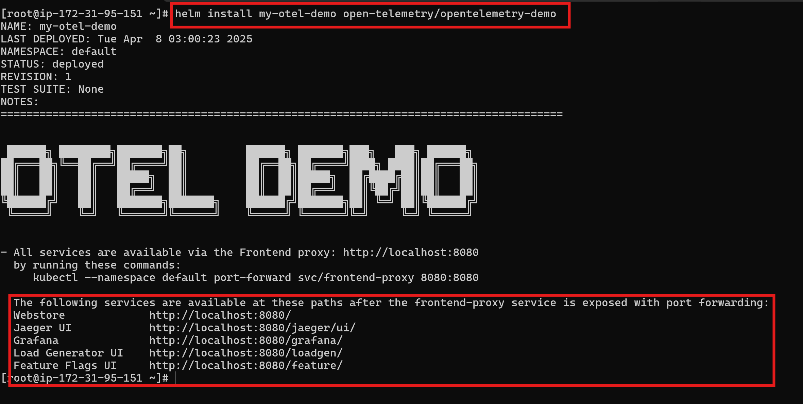

# 🛠️ Deployment Steps for Microservices Application on Amazon EKS and Observability

## 🚀 EKS Cluster Setup

To deploy this application on Amazon EKS, follow the instructions in the link below:

👉 [EKS Cluster Setup Guide](eks-setup.md)

## Add Helm chart

If not installed, install helm on linux
```bash
helm repo add open-telemetry https://open-telemetry.github.io/opentelemetry-helm-charts
```
 
## Install Helm chart  
Install the chart with the release name `my-otel-demo`:
```bash
helm install my-otel-demo open-telemetry/opentelemetry-demo
```

