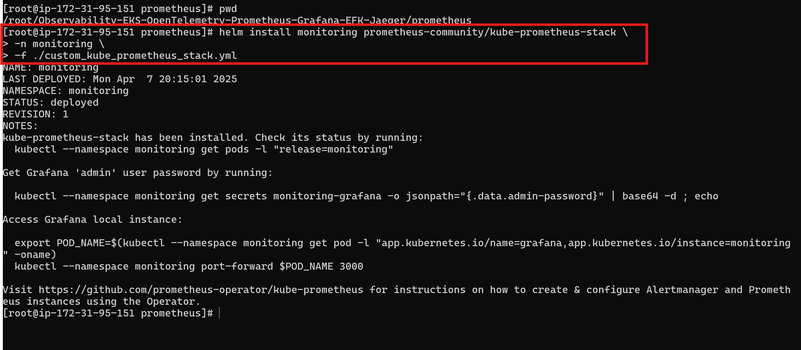

# 📡 Prometheus Overview
- Prometheus is an open-source systems monitoring and alerting toolkit originally built at SoundCloud.
- It is known for its robust data model, powerful query language (PromQL), and the ability to generate alerts based on the collected time-series data.
- It can be configured and set up on both bare-metal servers and container environments like Kubernetes.
---

## 🏠 Prometheus Architecture

The architecture of Prometheus is designed to be highly flexible, scalable, and modular.  
It consists of several core components, each responsible for a specific aspect of the monitoring process.

### 🖼️ Architecture Diagram


---

### 🔧 Core Components

- **Prometheus Server**: The brain of Prometheus. It pulls metrics from endpoints, stores them in TSDB, and exposes APIs for querying via PromQL.
- **Retrieval**: The module responsible for scraping metrics from discovered targets.
- **TSDB (Time Series Database)**: Stores the scraped metrics in a format optimized for time-series data.
- **Exporters**: Agents or sidecars that expose metrics in Prometheus format. Common ones include:
  - `node_exporter` for system metrics
  - `kube-state-metrics` for Kubernetes resources
  - `blackbox_exporter` for endpoint probes
- **Pushgateway**: Allows short-lived jobs (e.g., batch jobs) to push metrics that can’t be scraped directly.
- **Service Discovery**: Automatically finds targets (e.g., Kubernetes services, EC2 instances).
- **Alert Manager**: The Alertmanager is responsible for managing alerts generated by the Prometheus server.
- **API Clients**: API clients interact with Prometheus through its HTTP API to fetch data, query metrics, and integrate Prometheus with other systems or custom applications.

---

# 🛠️  Installation & Configurations

### Prerequisites
- Download and Install AWS Cli - Please Refer [this]("https://docs.aws.amazon.com/cli/latest/userguide/getting-started-install.html") link.
- Setup and configure AWS CLI using the `aws configure` command.
- Install and configure eksctl using the steps mentioned [here]("https://eksctl.io/installation/").
- Install and configure kubectl as mentioned [here]("https://kubernetes.io/docs/tasks/tools/").
---

# 🚀 Prometheus Setup on EKS using Helm

This guide outlines the steps to create an EKS cluster and deploy Prometheus using the `kube-prometheus-stack` Helm chart.

---

## 🛠️ Step 1: Create an EKS Cluster

```bash
eksctl create cluster --name=observability \
                      --region=us-east-1 \
                      --zones=us-east-1a,us-east-1b \
                      --without-nodegroup
```
## 🛠️ Step 2: Create a Node Group
```bash
eksctl create nodegroup --cluster=observability \
                        --region=us-east-1 \
                        --name=observability-ng-private \
                        --node-type=t3.medium \
                        --nodes-min=2 \
                        --nodes-max=3 \
                        --node-volume-size=20 \
                        --managed \
                        --asg-access \
                        --external-dns-access \
                        --full-ecr-access \
                        --appmesh-access \
                        --alb-ingress-access
```


## 🛠️ Step 3: Update Your ~/.kube/config
```bash
aws eks update-kubeconfig --name observability
```


## 🛠️ Step 4: Install kube-prometheus-stack Helm Chart
**Install Helm**
```bash
helm repo add prometheus-community https://prometheus-community.github.io/helm-charts
helm repo update
```

## 🛠️ Step 5: Deploy the Chart into a New Namespace monitoring
```bash
kubectl create ns monitoring
```

## 🛠️ Step 6: Then Install the Chart

Fork my repo, go to: **"Observability-EKS-OpenTelemetry-Prometheus-Grafana-EFK-Jaeger
/prometheus/"**
and install the Prometheus Helm release using:
```bash
cd /root/Observability-EKS-OpenTelemetry-Prometheus-Grafana-EFK-Jaeger/prometheus

helm install monitoring prometheus-community/kube-prometheus-stack \
-n monitoring \
-f ./custom_kube_prometheus_stack.yml
```



## 🛠️ Step 7: Verify the Installation
```bash
kubectl get all -n monitoring
```

## 🛠️ Step 8: Check its status by running
Here you can see that you've two **node-exporter** one **kube-state-metrics**
```bash
kubectl --namespace monitoring get pods -l "release=monitoring"
```


**Access the dashboards**

**NOTE:** If you are using an EC2 Instance or Cloud VM, you need to pass `--address 0.0.0.0` to the above command. Then you can access the UI on **<instance-ip:port>**

- **Prometheus UI**:
```bash
kubectl port-forward service/prometheus-operated -n monitoring 9090:9090
```

- **Grafana UI**
- Default login: admin / prom-operator (or check the secret)
```bash
kubectl port-forward service/monitoring-grafana -n monitoring 8080:80
```

- **Alertmanager UI**:
```bash
kubectl port-forward service/alertmanager-operated -n monitoring 9093:9093
```

## ❗ Having Trouble Accessing Dashboards?

If you're unable to access the Prometheus, Grafana, or Alertmanager dashboards:

### ✅ Check Your Security Groups (Especially on AWS)

Make sure your EC2 instance or worker node security groups allow inbound traffic on the following ports:

- **80** – HTTP
- **443** – HTTPS (if using Ingress/TLS)
- **8080**, **9090**, **9093**
- **All Traffic** – *(for quick testing only; not recommended for production)*

> ⚠️ Remember to **restrict access** to specific IPs in production environments for better security.


## 🎯 Why You Can Access Grafana & Alertmanager Automatically

When you install the `kube-prometheus-stack` Helm chart, you're not just installing Prometheus — you're deploying a **bundle of observability tools**.

This Helm chart is a full-stack monitoring solution that includes the following components:

- **Prometheus** – Core metrics collection engine  
- **Alertmanager** – Manages and routes alerts generated by Prometheus  
- **Grafana** – Visualizes metrics through dashboards  
- **Node Exporter** – Collects hardware/system metrics from nodes  
- **Kube-State-Metrics** – Exposes Kubernetes resource states (pods, deployments, etc.)

All these components are automatically deployed and pre-configured when you install the chart, which is why you're able to access **Grafana** and **Alertmanager** without any extra setup.

